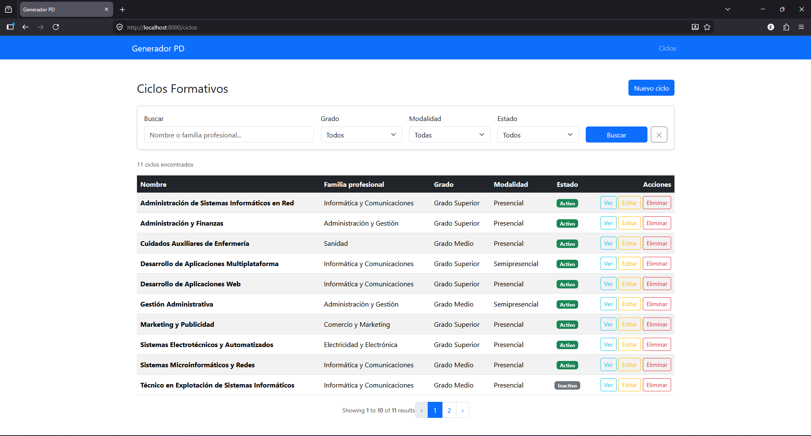
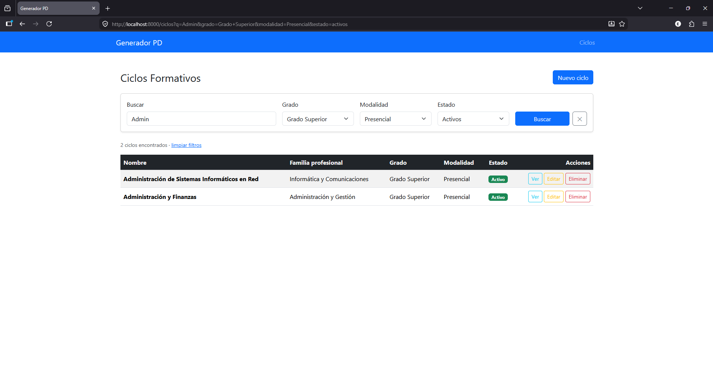
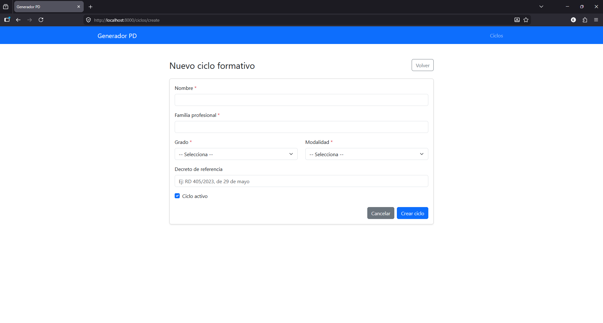
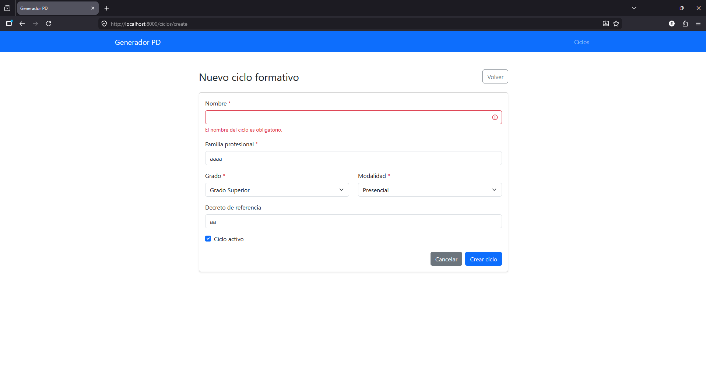
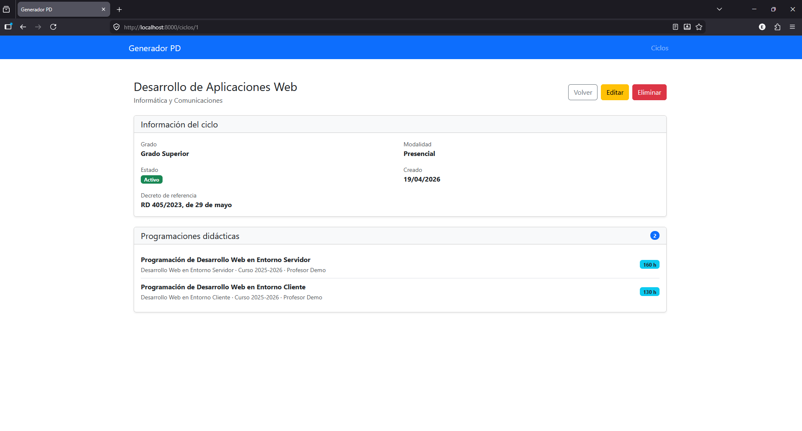
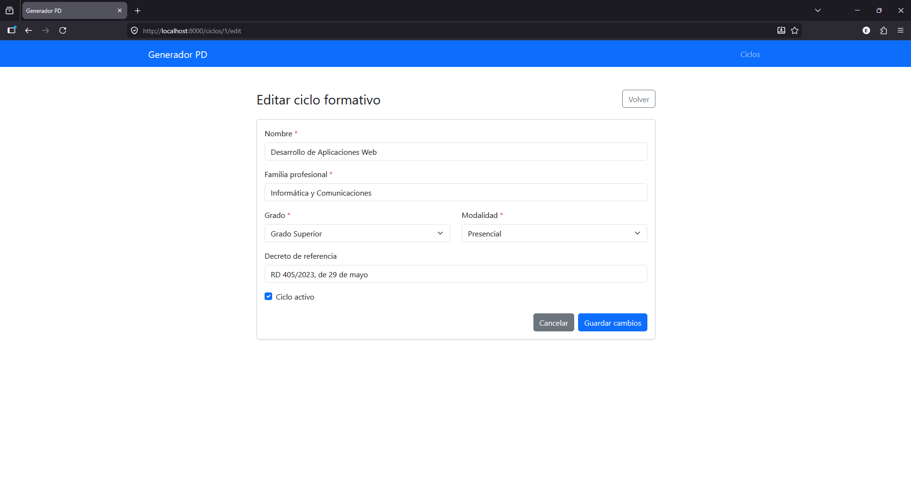
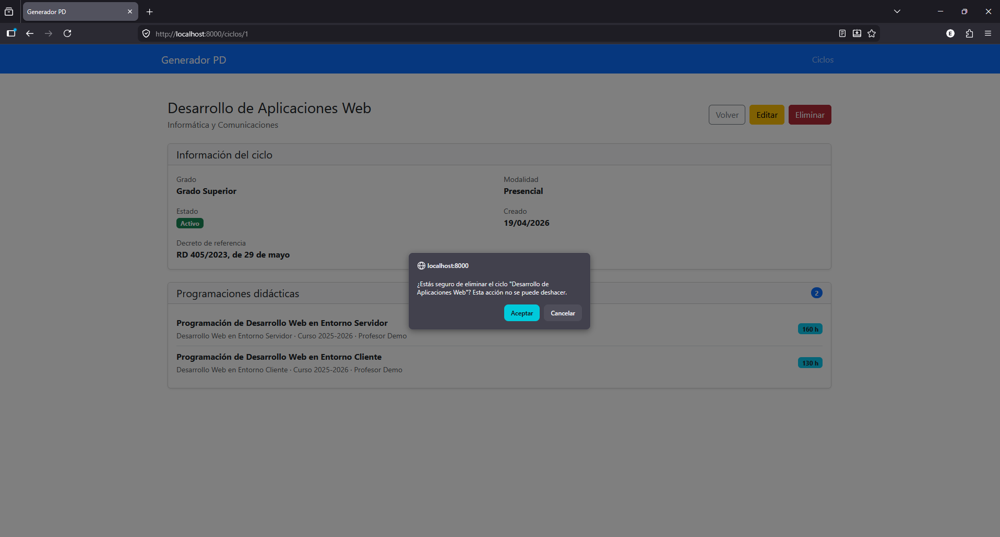
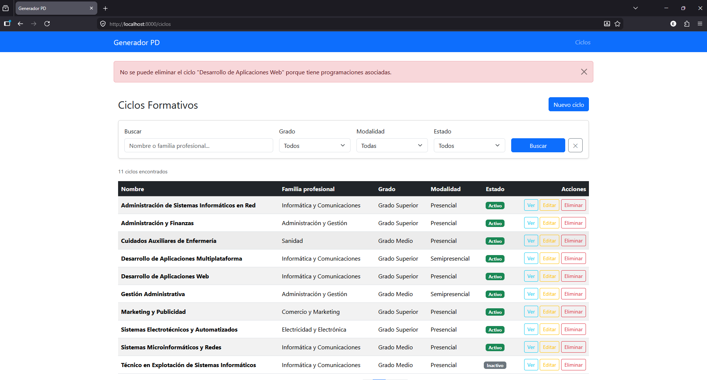

 # Manual de usuario — Módulo B (Ciclos Formativos)

  Este manual describe paso a paso cómo se usa el módulo de Ciclos Formativos. Asumo que la aplicación ya está arrancada en `http://localhost:8000` (si no,
  mira el README en la raíz del repo).

  ## Acceso a la aplicación

  Al abrir `http://localhost:8000` la raíz redirige automáticamente al listado de ciclos (`/ciclos`), así que la primera pantalla que ves es esta:

  

  En la cabecera tengo el navbar con el enlace **Ciclos**. El listado muestra los ciclos paginados de 10 en 10, con su nombre, familia profesional, grado,
  modalidad y un badge de estado (Activo / Inactivo).

  ## Búsqueda y filtros

  Encima de la tabla hay un formulario con cuatro controles: **Buscar** (texto libre por nombre o familia profesional), **Grado**, **Modalidad** y
  **Estado**. Aplicarlos hace un GET con los parámetros en la URL y la paginación los mantiene gracias a `withQueryString()`.

  

  En la captura se ven los filtros activos y la query string (`?q=…&grado=…`) en la URL del navegador. Para limpiar los filtros uso el botón ✕ que hay junto
   a "Buscar" o el enlace "Limpiar filtros" que aparece debajo del contador de resultados.

  ## Crear un ciclo nuevo

  Pulsando el botón **Nuevo ciclo** del listado se abre el formulario de alta:

  

  Los campos son:

  - **Nombre** (obligatorio, máx. 150 caracteres, único en la tabla)
  - **Familia profesional** (obligatorio, máx. 100 caracteres)
  - **Grado** (Grado Superior / Grado Medio)
  - **Modalidad** (Presencial / Semipresencial)
  - **Decreto de referencia** (opcional, máx. 250 caracteres)
  - **Activo** (checkbox, por defecto activado)

  Al enviar el formulario, la validación se hace en el servidor mediante un Form Request. Si algún campo no cumple las reglas, vuelve al formulario con los
  errores marcados en español:

  

  En esta captura he intentado guardar un ciclo dejando el nombre vacío y se ve el mensaje `El nombre del ciclo es obligatorio.` debajo del input.

  ## Ver el detalle de un ciclo

  Desde el listado, pulsando el botón **Ver** de cualquier fila, se abre la vista de detalle:

  

  La parte de arriba muestra los datos del ciclo. Debajo aparece la lista de **programaciones didácticas asociadas** (cuando las hay). Esa lista se carga
  con eager loading (`$ciclo->load('programaciones')`) para evitar consultas extra por cada fila.

  ## Editar un ciclo

  El botón **Editar** abre el formulario precargado con los valores actuales:

  

  La validación es la misma que en el alta, con la diferencia de que la regla de unicidad del nombre lleva `->ignore($this->ciclo)`, así que al guardar sin
  cambiar el nombre no salta el error de duplicado. Tras guardar redirige al detalle del ciclo con un mensaje flash de éxito.

  ## Borrar un ciclo

  El botón **Borrar** del listado o del detalle pide confirmación:

  

  Si el ciclo **no tiene programaciones asociadas**, al confirmar se borra y se vuelve al listado con un flash de éxito.

  Si el ciclo **sí tiene programaciones**, el controlador no permite el borrado y se muestra un mensaje de error explicando que primero hay que quitar o
  reasignar esas programaciones:

  

  Esto es la primera capa de protección. Como segunda capa, la migración tiene `ON DELETE CASCADE` por si alguien hiciera el borrado directamente en la base
   de datos saltándose la app — en ese caso las programaciones se eliminarían en cascada y la BD quedaría coherente.

  ## Resumen de mensajes flash

  | Acción                                            | Mensaje                                            |
  |---------------------------------------------------|----------------------------------------------------|
  | Crear ciclo correctamente                         | Ciclo formativo creado con éxito.                  |
  | Editar ciclo correctamente                        | Ciclo formativo actualizado con éxito.             |
  | Borrar ciclo sin programaciones                   | Ciclo formativo eliminado con éxito.               |
  | Intentar borrar un ciclo con programaciones       | No se puede eliminar: el ciclo tiene programaciones asociadas. |
  | Validación fallida en alta o edición              | (los errores se muestran junto a cada campo)       |

  Guía de las 8 capturas

  Lánzate la app (php artisan serve y abre http://localhost:8000). Asegúrate de tener los datos de prueba (php artisan migrate:fresh --seed).
